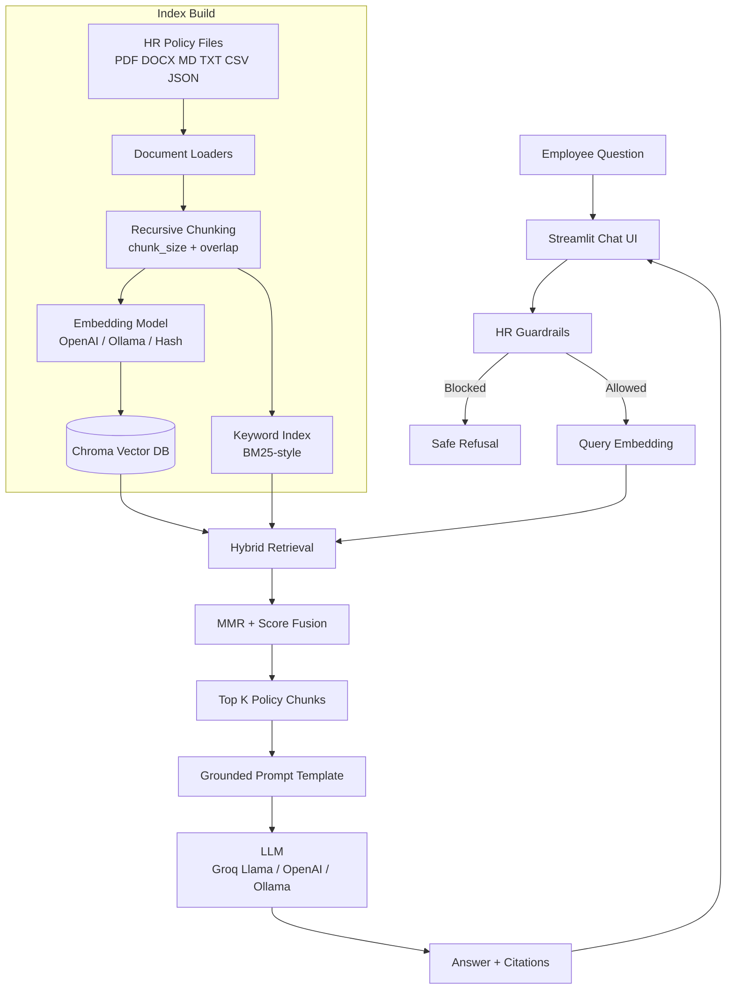
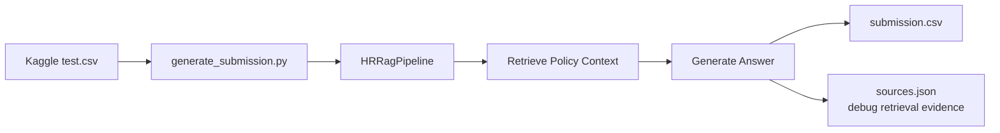

# Technical README: HR Help Desk RAG Architecture

This document explains what was added to the project, which LangChain components are used, which LLM options are supported, how the RAG pipeline works, which vector database is used, and how the full system connects together.

## Project Goal

The system is an AI-powered HR Help Desk chatbot for Zyro Dynamics. It answers employee questions about HR policies such as leave, payroll, benefits, compliance, employee conduct, onboarding, and offboarding.

The assistant is built as a Retrieval-Augmented Generation system. It does not answer from the LLM's memory alone. It first retrieves relevant HR policy chunks, then asks the language model to answer using only that retrieved context.

## Technology Stack

| Layer | Tool Used | Purpose |
| --- | --- | --- |
| Application UI | Streamlit | Chatbot interface for employees |
| RAG Orchestration | LangChain | Document loading, prompt chaining, model integration, output parsing |
| Vector Database | Chroma | Persistent vector store for HR policy chunks |
| Fallback Vector Search | In-memory Python vector store | Keeps the app runnable if Chroma native bindings fail |
| Embeddings | OpenAI / Ollama / local hash embeddings | Converts policy chunks and questions into searchable vectors |
| LLM | Groq Llama / OpenAI / Ollama Llama | Generates grounded answers from retrieved policy context |
| PDF Loading | PyPDFLoader | Reads PDF HR policy documents |
| DOCX Loading | built-in zip/XML parser | Reads Word policy documents without extra dependencies |
| Text Splitting | RecursiveCharacterTextSplitter | Splits long documents into overlapping chunks |
| Batch Submission | pandas + CLI script | Generates Kaggle `submission.csv` answers |

## Kaggle Challenge Components

The HR Help Desk solution uses these core retrieval and generation components:

| Component | Status | Implementation |
| --- | --- | --- |
| Retrieval Chain / RAG Chain | Yes | `HRRagPipeline.answer()` runs guardrails, retrieval, prompt construction, and generation |
| Stuff Documents Chain | Yes | `create_stuff_documents_chain()` stuffs retrieved policy chunks into the answer prompt |
| Hybrid Retrieval | Yes | Chroma vector retrieval is fused with BM25-style keyword retrieval |
| MMR Retrieval | Yes | `max_marginal_relevance_search()` improves diversity before final reranking |

## LLM Options

The pipeline supports multiple generation providers:

| Provider | Model Example | How It Is Used |
| --- | --- | --- |
| Groq | `llama-3.1-8b-instant` | Fast hosted Llama model for answer generation |
| OpenAI | `gpt-4o-mini` | Hosted model option if OpenAI key is available |
| Ollama | `llama3.1` | Local Llama option for offline/local generation |
| Extractive fallback | No LLM | Returns relevant policy snippets when no API/model is available |

Provider selection is automatic by default:

1. If `GROQ_API_KEY` is available, Groq Llama is used for generation.
2. Else if `OPENAI_API_KEY` is available, OpenAI is used.
3. Else if `OLLAMA_LLM_MODEL` is set, local Ollama is used.
4. Else the app falls back to extractive answers.

## Embedding Options

The embedding layer also supports multiple providers:

| Provider | Model Example | Purpose |
| --- | --- | --- |
| OpenAI | `text-embedding-3-small` | Strong hosted embedding model |
| Ollama | `nomic-embed-text` | Local embedding model |
| Local hash embeddings | Built into `hr_rag/pipeline.py` | Offline fallback for testing without keys |

For best leaderboard performance, use a strong embedding model such as OpenAI embeddings or a high-quality local embedding model. The hash embedding fallback is mainly for development when no API keys are available.

## Vector Database

The main vector database is Chroma.

Chroma stores the embedded HR policy chunks in a persistent folder:

```text
chroma_hr_store/
```

For temporary local testing, the project can use:

```text
chroma_hr_temp_store/
```

If Chroma fails because of local native dependency issues, the code automatically falls back to a pure Python in-memory vector store. This keeps development moving, but Chroma is preferred for real runs.

## RAG Pipeline

The core pipeline lives in:

```text
hr_rag/pipeline.py
```

Pipeline steps:

1. Load HR policy documents from `hr_docs/`.
2. Parse supported formats: `.pdf`, `.docx`, `.md`, `.txt`, `.csv`, `.json`.
3. Split documents into overlapping chunks using `RecursiveCharacterTextSplitter`.
4. Generate embeddings for each chunk.
5. Store embeddings and chunk metadata in Chroma.
6. At question time, apply guardrails.
7. Retrieve relevant chunks using vector search and lexical search.
8. Merge and rank retrieved chunks.
9. Build a grounded prompt with the retrieved context.
10. Generate the final answer with citations.

## Retrieval Strategy

The retriever uses a hybrid approach:

| Retrieval Method | Why It Helps |
| --- | --- |
| Vector similarity search | Finds semantically related policy chunks even if wording differs |
| Max Marginal Relevance | Reduces duplicate chunks and improves context diversity |
| BM25-style keyword search | Helps with exact HR terms, policy names, dates, acronyms, and benefit names |
| Score fusion | Combines semantic and lexical signals for stronger retrieval |

This matters because HR questions often contain exact terms such as leave type, benefit name, notice period, payroll, probation, or reimbursement.

## LangChain Chains Used

The HR assistant uses a fixed RAG chain rather than a dynamic agent.

The high-level chain is:

```text
Employee question -> Guardrails -> Hybrid retriever -> Stuff Documents Chain -> LLM answer
```

The retrieved documents are passed into a Stuff Documents Chain:

```python
stuff_chain = create_stuff_documents_chain(
    llm,
    prompt,
    document_prompt=document_prompt,
)
```

The fallback generation chain follows this LangChain Expression Language pattern:

```python
prompt | llm | StrOutputParser()
```

Why a chain instead of an agent:

- HR Q&A has a known flow: retrieve policy content, then answer.
- Chains are more predictable for leaderboard evaluation.
- Chains are easier to debug and tune than agents.
- Agents add extra reasoning/tool steps that can increase hallucination risk.

The older API documentation demo still contains agent/tool examples, but the HR competition pipeline intentionally uses a simple, controlled RAG chain.

## Guardrails

Guardrails are implemented before retrieval and generation.

The system blocks or refuses:

- Non-HR questions
- Requests for credentials, API keys, passwords, or secret tokens
- Requests for another employee's private data
- Sensitive identifiers such as SSN, Aadhaar, PAN, bank account, or passport information
- Questions that are too short to understand

If a question is unsupported by the retrieved policy context, the assistant is instructed to say that it could not find the answer in Zyro Dynamics HR policy documents.

## Visual Architecture



## Batch Submission Architecture



## Main Files Added

| File | Purpose |
| --- | --- |
| `hr_rag/pipeline.py` | Main reusable RAG pipeline |
| `hr_rag/__init__.py` | Package export file |
| `streamlit_hr_helpdesk.py` | Streamlit chatbot UI |
| `generate_submission.py` | Kaggle batch submission generator |
| `hr_docs/README.md` | Policy document folder instructions |
| `hr_docs/temp_policies/` | Temporary HR policy documents for local testing |
| `.env.example` | Safe environment variable template |
| `.gitignore` | Prevents secrets, vector stores, and generated outputs from being committed |

## Runtime Modes

| Mode | Command | Use Case |
| --- | --- | --- |
| Streamlit chatbot | `streamlit run streamlit_hr_helpdesk.py` | Interactive demo and deployment |
| Kaggle batch answers | `python generate_submission.py --questions test.csv --output submission.csv --rebuild` | Leaderboard submission |
| Offline smoke test | `--embedding-provider hash --llm-provider extractive` | Development without API keys |

## API Keys And LangSmith

Put real keys only in `.env`, not `.env.example`.

```text
GROQ_API_KEY=your-groq-key
OPENAI_API_KEY=your-openai-key
LANGCHAIN_API_KEY=your-langsmith-key
LANGCHAIN_PROJECT=zyro-hr-helpdesk
LANGCHAIN_TRACING_V2=true
```

The code loads `.env` from the project folder or parent repo folder. For compatibility with LangSmith versions, `LANGCHAIN_API_KEY` is also copied into `LANGSMITH_API_KEY` at runtime if needed.

## Recommended Competition Settings

Start with:

```text
chunk_size = 900
chunk_overlap = 180
retrieval_k = 6
fetch_k = 24
embedding_provider = openai or ollama
llm_provider = groq or openai
```

Then tune:

- `chunk_size`: try `700`, `900`, `1100`
- `retrieval_k`: try `5`, `6`, `8`
- `fetch_k`: try `24`, `36`, `48`
- Inspect `.sources.json` after each batch run to see whether the correct policy chunks were retrieved.

## Design Summary

This project uses LangChain for orchestration, Chroma as the main vector database, a RetrievalQA-style LCEL chain for answer generation, and Llama-compatible model options through Groq or Ollama. The system is designed to be grounded, citation-based, guardrailed, and reproducible for Kaggle submission generation.
